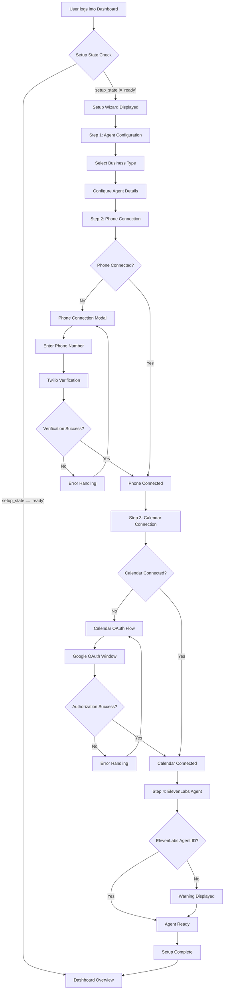

# User Flow: Agent Setup

## Overview

This flow documents the complete process of setting up a Voice Agent in the AIDevelo dashboard, from initial dashboard access to a fully configured and active agent.

## User Journey Map

## Flow Steps

### Step 1: Initial Dashboard Access
1. User navigates to `/dashboard`
2. System checks `overview.agent_config.setup_state`
3. If `setup_state !== 'ready'`, Setup Wizard is displayed
4. If `setup_state === 'ready'`, dashboard overview is shown

### Step 2: Setup Wizard - Agent Configuration
1. User sees Setup Wizard component
2. User selects business type (e.g., "salon", "praxis", "garage")
3. User configures agent name and basic settings
4. System saves configuration via API

### Step 3: Phone Connection
1. User clicks "Telefon verbinden" button
2. PhoneConnectionModal opens
3. User enters phone number or selects from Twilio available numbers
4. System initiates Twilio phone number purchase/connection
5. Webhook URL is configured automatically
6. Success: Phone status changes to 'connected'
7. Error: Error message displayed, user can retry

### Step 4: Calendar Connection
1. User clicks "Kalender verbinden" button
2. System requests OAuth URL from backend
3. OAuth popup window opens
4. User authorizes Google Calendar access
5. System receives OAuth callback
6. Backend exchanges code for tokens
7. Success: Calendar status changes to 'connected'
8. Error: Error message displayed, user can retry

### Step 5: ElevenLabs Agent Configuration
1. System checks for `eleven_agent_id` in agent config
2. If missing, warning is displayed: "ElevenLabs Agent ID fehlt"
3. User may need to configure ElevenLabs agent separately
4. Once configured, agent becomes fully active

### Step 6: Setup Complete
1. All required connections established
2. `setup_state` changes to 'ready'
3. Setup Wizard disappears
4. Full dashboard functionality available

## Decision Points

### Phone Connection
- **Path A (Success)**: Phone number connected → Proceed to Calendar
- **Path B (Error)**: Connection failed → Show error, allow retry
- **Path C (Already Connected)**: Skip phone connection step

### Calendar Connection
- **Path A (Success)**: Calendar connected → Proceed to final steps
- **Path B (Error)**: OAuth failed → Show error, allow retry
- **Path C (Already Connected)**: Skip calendar connection step

### ElevenLabs Agent
- **Path A (Configured)**: Agent ID present → Agent fully active
- **Path B (Missing)**: Warning displayed → User can continue, agent limited functionality

## Error Handling

### Phone Connection Errors
- **Error**: "Phone number already in use"
  - **Recovery**: User selects different number or releases existing number
- **Error**: "Twilio API error"
  - **Recovery**: System retries, user can manually retry
- **Error**: "Webhook configuration failed"
  - **Recovery**: System automatically retries webhook setup

### Calendar Connection Errors
- **Error**: "OAuth popup blocked"
  - **Recovery**: User allows popups, retries connection
- **Error**: "Invalid OAuth code"
  - **Recovery**: System initiates new OAuth flow
- **Error**: "Token refresh failed"
  - **Recovery**: User re-authorizes calendar access

### General Errors
- **Error**: "Network error"
  - **Recovery**: User retries action, system shows retry button
- **Error**: "Session expired"
  - **Recovery**: User redirected to login, then back to setup

## Success Criteria

- [ ] Phone number successfully connected and verified
- [ ] Calendar OAuth completed and tokens stored
- [ ] Agent configuration saved with business type
- [ ] Setup state changes to 'ready'
- [ ] Dashboard shows all connected services as active
- [ ] User can test agent functionality
- [ ] User can receive and handle calls

## Pain Points and Improvements

### Current Pain Points
1. **OAuth Popup Blocking**: Users may have popups blocked
   - **Improvement**: Add fallback to same-window OAuth flow
2. **Multi-step Process**: Setup feels lengthy
   - **Improvement**: Show progress indicator, allow skipping optional steps
3. **Error Recovery**: Errors require manual retry
   - **Improvement**: Automatic retry with exponential backoff
4. **ElevenLabs Integration**: Unclear how to configure
   - **Improvement**: Add inline guide or direct link to ElevenLabs setup

### Future Enhancements
- Bulk setup for multiple agents
- Setup templates for common business types
- Guided tour for first-time users
- Setup progress saved (resume later)
