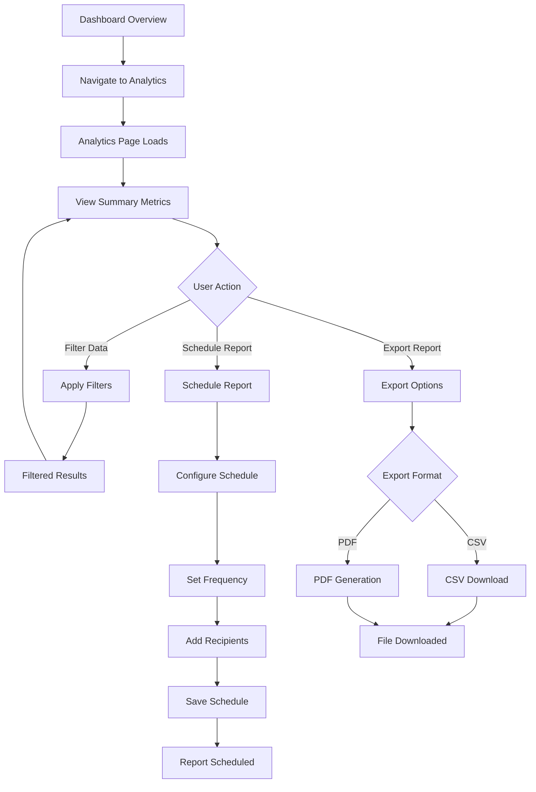

# User Flow: Analytics Review

## Overview

This flow documents how users review analytics, generate reports, and export data from the dashboard.

## User Journey Map

## Flow Steps

### Step 1: Navigate to Analytics
1. User clicks "Analytics" in SideNav
2. Navigates to `/analytics`
3. Analytics page loads with default filters (last 30 days)
4. Summary metrics displayed:
   - Total calls
   - Completed calls
   - Missed calls
   - Average duration
   - Top sources

### Step 2: View Summary Metrics
1. User sees KPI cards at top of page
2. Charts display call volume over time
3. Top sources table shows most common callers
4. All data reflects current filter settings

### Step 3: Apply Filters
1. User clicks filter section or filter icon
2. Filter panel expands/collapses
3. User can filter by:
   - Date range (from/to)
   - Call direction (inbound/outbound)
   - Call outcome (completed, missed, etc.)
4. Filters apply immediately
5. Charts and tables update
6. Summary metrics recalculate

### Step 4: Export Report
1. User clicks "Export" button
2. Export options modal appears:
   - Export as CSV
   - Export as PDF
   - Current filters applied
3. User selects format
4. System generates export file
5. File downloads automatically
6. Success notification displayed

### Step 5: Schedule Report (Optional)
1. User clicks "Schedule Report" button
2. Schedule form appears:
   - Frequency (daily, weekly, monthly)
   - Recipients (email addresses)
   - Report format
   - Filter settings (use current or custom)
3. User configures schedule
4. User saves schedule
5. System confirms schedule creation
6. Reports sent automatically per schedule

## Decision Points

### Filter Application
- **Path A (Apply Filters)**: Data filtered → Results update immediately
- **Path B (Clear Filters)**: Filters reset → Default view restored
- **Path C (Save Filter Preset)**: Filters saved → Can reuse later

### Export Format
- **Path A (CSV)**: Raw data export → Quick download, Excel-compatible
- **Path B (PDF)**: Formatted report → Visual charts, professional format
- **Path C (Cancel)**: Export cancelled → Return to analytics view

### Schedule Configuration
- **Path A (Save Schedule)**: Report scheduled → Automatic delivery configured
- **Path B (Test First)**: Test email sent → User verifies before saving
- **Path C (Cancel)**: Schedule cancelled → Return to analytics view

## Error Handling

### Data Loading Errors
- **Error**: "Failed to load analytics data"
  - **Recovery**: User can retry, system shows error message
- **Error**: "Filter results empty"
  - **Recovery**: System suggests adjusting filters, shows empty state

### Export Errors
- **Error**: "Export generation failed"
  - **Recovery**: System retries, user can try again
- **Error**: "File too large for export"
  - **Recovery**: System suggests date range reduction, or async export

### Schedule Errors
- **Error**: "Invalid email address"
  - **Recovery**: System highlights invalid emails, user corrects
- **Error**: "Schedule creation failed"
  - **Recovery**: System shows error, user can retry

## Success Criteria

- [ ] Analytics page loads within 2 seconds
- [ ] Summary metrics display correctly
- [ ] Filters apply and update results immediately
- [ ] Export files download successfully
- [ ] Scheduled reports are created and saved
- [ ] Reports are delivered per schedule
- [ ] Data accuracy maintained across all views

## Pain Points and Improvements

### Current Pain Points
1. **Slow Data Loading**: Large date ranges cause delays
   - **Improvement**: Implement pagination, lazy loading, data caching
2. **Limited Filter Options**: Cannot filter by specific criteria
   - **Improvement**: Add more filter options (caller, duration, etc.)
3. **Export Format Limitations**: Only CSV/PDF available
   - **Improvement**: Add Excel, JSON formats
4. **No Real-time Updates**: Data may be stale
   - **Improvement**: Add auto-refresh or WebSocket updates

### Future Enhancements
- Custom dashboard widgets
- Comparison mode (compare time periods)
- Advanced analytics (trends, predictions)
- Interactive charts with drill-down
- Report templates and customization
