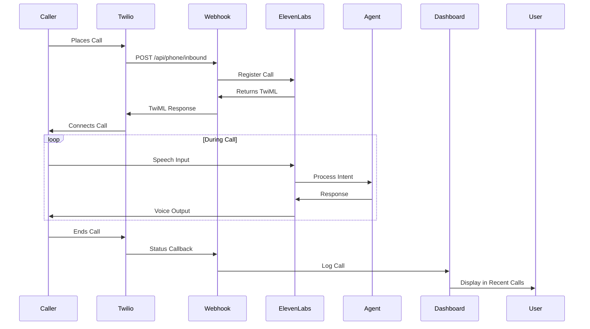

# User Flow: Call Management

## Overview

This flow documents how incoming calls are handled by the Voice Agent, logged, and managed in the dashboard.

## User Journey Map

## Flow Steps

### Step 1: Incoming Call
1. Caller dials configured phone number
2. Twilio receives call and triggers webhook
3. Webhook validates Twilio signature
4. System creates call record in database
5. ElevenLabs register-call API is called
6. TwiML response returned to Twilio
7. Call is connected to ElevenLabs agent

### Step 2: Call Processing
1. Agent greets caller using configured script
2. Agent processes caller's speech input
3. Agent determines intent (appointment booking, information request, etc.)
4. Agent executes appropriate action:
   - Check calendar availability
   - Create appointment
   - Provide information
   - Transfer to human (if needed)
5. Agent confirms actions with caller
6. Call continues until completion or transfer

### Step 3: Call Completion
1. Caller ends call or agent completes task
2. Twilio sends status callback to webhook
3. System updates call record with:
   - Duration
   - Outcome (completed, missed, voicemail)
   - Notes/transcript (if available)
4. Call appears in Recent Calls table
5. Dashboard updates KPI metrics

### Step 4: Call Review
1. User views Recent Calls in dashboard
2. User clicks on call to view details
3. CallDetailsModal displays:
   - Call metadata (time, duration, numbers)
   - Call transcript (if available)
   - Outcome and notes
   - Actions taken (appointments created, etc.)
4. User can add notes or follow-up actions

## Decision Points

### Call Outcome
- **Path A (Completed)**: Call successfully handled → Logged as "completed"
- **Path B (Missed)**: Call not answered → Logged as "missed"
- **Path C (Voicemail)**: Voicemail left → Logged as "voicemail"
- **Path D (Failed)**: Technical failure → Logged as "failed"

### Agent Actions
- **Path A (Appointment Booked)**: Agent books appointment → Calendar updated, call logged
- **Path B (Information Provided)**: Agent answers question → Call logged, no calendar action
- **Path C (Transfer Needed)**: Agent transfers to human → Call logged with transfer reason
- **Path D (Callback Requested)**: Caller requests callback → Call logged, callback scheduled

## Error Handling

### Webhook Errors
- **Error**: "Invalid Twilio signature"
  - **Recovery**: System logs error, call may fail, admin notified
- **Error**: "ElevenLabs API error"
  - **Recovery**: Fallback to basic TwiML, call continues with limited functionality

### Call Processing Errors
- **Error**: "Calendar API unavailable"
  - **Recovery**: Agent informs caller, offers callback option
- **Error**: "Database write failure"
  - **Recovery**: System retries, call continues normally

## Success Criteria

- [ ] Incoming call successfully routed to agent
- [ ] Agent processes caller's request
- [ ] Appropriate actions taken (appointment booking, etc.)
- [ ] Call logged with accurate metadata
- [ ] Call appears in Recent Calls within 5 seconds
- [ ] User can view call details
- [ ] KPI metrics update correctly

## Pain Points and Improvements

### Current Pain Points
1. **Call Logging Delay**: Calls may not appear immediately
   - **Improvement**: Real-time updates via WebSocket or polling
2. **Limited Transcript**: Full transcripts not always available
   - **Improvement**: Integrate transcription service
3. **No Call Recording**: Cannot replay calls
   - **Improvement**: Add Twilio call recording integration
4. **Manual Follow-up**: No automated follow-up system
   - **Improvement**: Add callback scheduling and reminders

### Future Enhancements
- Real-time call monitoring dashboard
- Call sentiment analysis
- Automated follow-up emails/SMS
- Call recording playback
- Advanced analytics and insights
