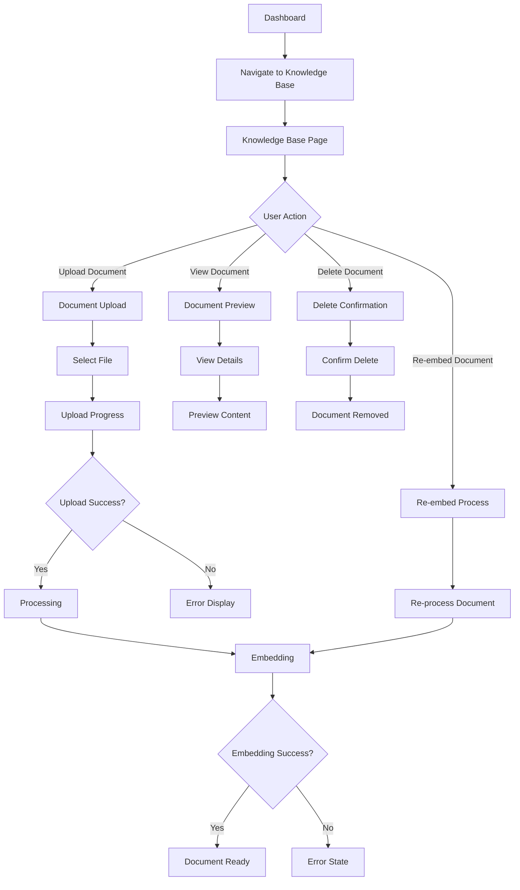

# User Flow: Knowledge Base Management

## Overview

This flow documents how users upload, manage, and use documents in the Knowledge Base for RAG (Retrieval-Augmented Generation) functionality.

## User Journey Map

## Flow Steps

### Step 1: Navigate to Knowledge Base
1. User clicks "Knowledge Base" in SideNav
2. Navigates to `/knowledge-base`
3. Knowledge Base page loads
4. Existing documents displayed (if any)
5. Upload button visible

### Step 2: Upload Document
1. User clicks "Dokument hochladen" button
2. DocumentUpload component opens (modal or inline)
3. User selects file(s) from device
4. Supported formats: PDF, TXT, DOCX, MD
5. File validation:
   - Check file size (max 10MB)
   - Check file type
   - Check if file already exists
6. Upload progress indicator shown
7. File uploaded to storage

### Step 3: Document Processing
1. System processes uploaded document
2. Document text extracted
3. Document status: "uploaded"
4. Chunking process begins
5. Embeddings generated via AI service
6. Embeddings stored in vector database
7. Document status: "embedded"
8. Document ready for use in agent

### Step 4: View Document
1. User clicks on document in list
2. DocumentPreviewModal opens
3. Document details displayed:
   - File name and metadata
   - Upload date and status
   - File size and type
   - Preview of content
4. User can:
   - View full content
   - Download original file
   - See embedding status
   - View usage statistics

### Step 5: Manage Documents
1. **Delete Document**:
   - User clicks delete icon
   - Confirmation dialog appears
   - User confirms deletion
   - Document and embeddings removed
   - Success notification shown

2. **Re-embed Document**:
   - User clicks "Re-embed" button
   - System re-processes document
   - New embeddings generated
   - Old embeddings replaced
   - Success notification shown

### Step 6: Document Usage in Agent
1. Agent receives query from caller
2. System searches knowledge base
3. Relevant document chunks retrieved
4. Context added to agent prompt
5. Agent uses information to answer caller
6. Usage tracked for analytics

## Decision Points

### Upload Process
- **Path A (Success)**: File uploaded → Processing begins
- **Path B (Validation Error)**: File rejected → Error shown, user can retry
- **Path C (Duplicate)**: File exists → User can replace or cancel

### Processing Outcome
- **Path A (Success)**: Document embedded → Ready for use
- **Path B (Processing Error)**: Error state → User can retry or delete
- **Path C (Partial Success)**: Some chunks failed → Warning shown, partial data available

### Document Status
- **Path A (Embedded)**: Fully processed → Available for agent use
- **Path B (Uploaded)**: Processing pending → User can wait or re-embed
- **Path C (Error)**: Processing failed → User can retry or delete

## Error Handling

### Upload Errors
- **Error**: "File too large"
  - **Recovery**: User selects smaller file or splits document
- **Error**: "Unsupported file type"
  - **Recovery**: System shows supported formats, user converts file
- **Error**: "Upload failed"
  - **Recovery**: System retries, user can try again

### Processing Errors
- **Error**: "Text extraction failed"
  - **Recovery**: User can try different file format or re-upload
- **Error**: "Embedding generation failed"
  - **Recovery**: System retries, user can manually re-embed
- **Error**: "Storage quota exceeded"
  - **Recovery**: User deletes old documents or upgrades plan

### Usage Errors
- **Error**: "Document not found in search"
  - **Recovery**: User verifies document is embedded, re-embeds if needed
- **Error**: "Search service unavailable"
  - **Recovery**: System falls back to basic search, agent continues

## Success Criteria

- [ ] Document uploads successfully
- [ ] Document processing completes within 30 seconds
- [ ] Embeddings generated and stored
- [ ] Document appears in list with correct status
- [ ] User can preview document content
- [ ] Document is searchable by agent
- [ ] Agent can use document information in conversations
- [ ] Usage statistics tracked accurately

## Pain Points and Improvements

### Current Pain Points
1. **Slow Processing**: Large documents take time to embed
   - **Improvement**: Show progress indicator, allow background processing
2. **Unclear Status**: Status indicators may be confusing
   - **Improvement**: Add tooltips, status descriptions, progress bars
3. **No Bulk Operations**: Must process documents one by one
   - **Improvement**: Add bulk upload and processing
4. **Limited Preview**: Cannot see full document content
   - **Improvement**: Add full document viewer with search

### Future Enhancements
- Document versioning
- Automatic re-embedding on schedule
- Document categories and tags
- Advanced search within documents
- Document usage analytics
- Integration with external knowledge sources
