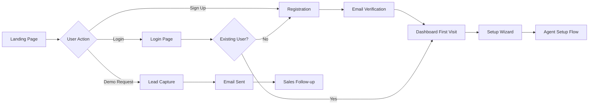

# User Flow: Onboarding

## Overview

This flow documents the complete user onboarding process from landing page to first agent setup.

## User Journey Map

## Flow Steps

### Step 1: Landing Page
1. User visits landing page (`/`)
2. User sees hero section with value proposition
3. User can:
   - Click "Onboarding starten" → Navigate to dashboard
   - Click "Login" → Navigate to login page
   - Fill lead capture form → Request demo
   - Scroll to learn more about features

### Step 2: Registration/Login
1. **New User (Registration)**:
   - User clicks "Onboarding starten"
   - Redirected to `/dashboard` (if authenticated) or `/login`
   - If not authenticated, Supabase auth flow initiated
   - User creates account or signs in with OAuth
   - Email verification may be required

2. **Existing User (Login)**:
   - User clicks "Login" button
   - Navigates to `/login` or `/dashboard` (if session exists)
   - Enters credentials or uses OAuth
   - Session established

### Step 3: First Dashboard Visit
1. User lands on `/dashboard`
2. System checks authentication
3. If authenticated:
   - Dashboard overview loads
   - If `setup_state !== 'ready'`, Setup Wizard displayed
   - If `setup_state === 'ready'`, full dashboard shown

### Step 4: Setup Wizard (First Time)
1. User sees Setup Wizard component
2. Wizard guides through:
   - Agent configuration
   - Phone connection
   - Calendar connection
   - Final verification
3. Each step must be completed before proceeding
4. User can skip optional steps (with warnings)

### Step 5: Lead Capture (Alternative Path)
1. User fills lead capture form on landing page
2. Form submitted to backend
3. Confirmation message displayed
4. Email sent to sales team
5. Sales team follows up within 24h
6. User may convert to sign-up later

## Decision Points

### Authentication Method
- **Path A (Email/Password)**: Traditional sign-up → Email verification required
- **Path B (OAuth)**: Social login → Faster, no email verification
- **Path C (Existing Session)**: Already logged in → Direct to dashboard

### First Visit Experience
- **Path A (New User)**: Setup Wizard displayed → Guided setup
- **Path B (Returning User)**: Dashboard overview → Continue where left off
- **Path C (Demo Request)**: Lead capture → Sales follow-up

## Error Handling

### Registration Errors
- **Error**: "Email already exists"
  - **Recovery**: User can login instead or reset password
- **Error**: "Weak password"
  - **Recovery**: System shows password requirements, user retries
- **Error**: "OAuth provider error"
  - **Recovery**: User can try different provider or email sign-up

### Authentication Errors
- **Error**: "Invalid credentials"
  - **Recovery**: User can reset password or try again
- **Error**: "Session expired"
  - **Recovery**: User redirected to login, session restored after login

### Setup Errors
- **Error**: "Setup incomplete"
  - **Recovery**: User can resume setup from where they left off
- **Error**: "Required step skipped"
  - **Recovery**: System highlights required steps, prevents completion

## Success Criteria

- [ ] User successfully creates account or logs in
- [ ] User reaches dashboard within 30 seconds
- [ ] Setup Wizard displays for new users
- [ ] User can complete setup or skip to explore
- [ ] Lead capture form submissions are received
- [ ] Email verification works (if required)
- [ ] Session persists across page refreshes

## Pain Points and Improvements

### Current Pain Points
1. **Multi-step Registration**: Email verification adds friction
   - **Improvement**: Allow OAuth-only flow, verify email later
2. **Setup Wizard Length**: Feels overwhelming for new users
   - **Improvement**: Progressive disclosure, show progress, allow skipping
3. **No Guided Tour**: Users may not understand dashboard features
   - **Improvement**: Add interactive tour for first-time users
4. **Lead Capture Friction**: Form may feel too long
   - **Improvement**: Minimize required fields, add social proof

### Future Enhancements
- Video walkthrough for setup
- Pre-filled setup based on industry selection
- Quick start templates
- In-app help and tooltips
- Onboarding progress tracking
